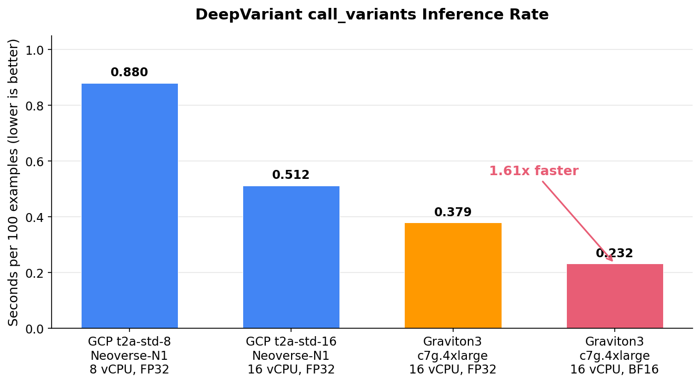
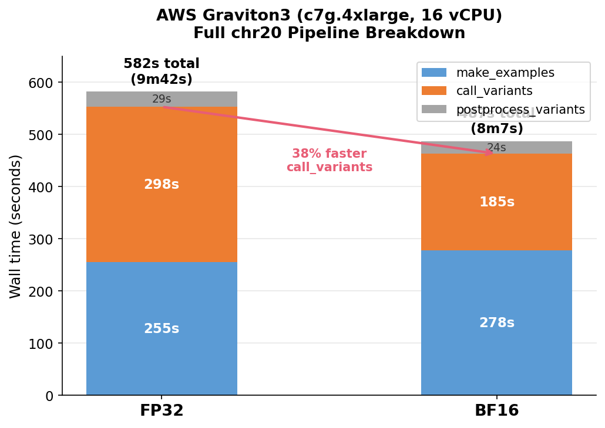
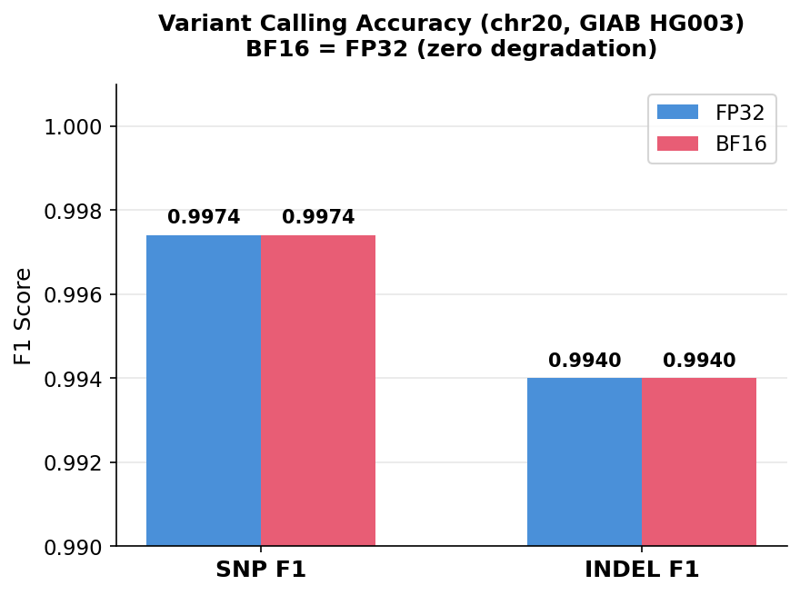
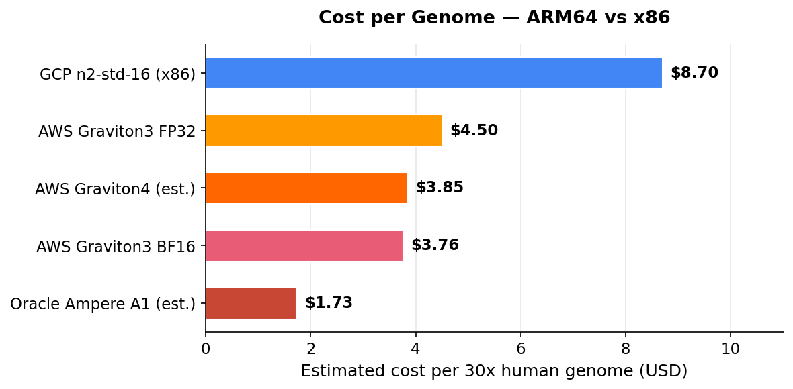

# DeepVariant — Linux ARM64 Native Build

[](https://github.com/google/deepvariant/releases)
[](https://en.wikipedia.org/wiki/AArch64)
[](#accuracy)

There is no official Linux ARM64 build of [DeepVariant](https://github.com/google/deepvariant). This fork patches the build system to compile natively on aarch64, producing a working Docker image for AWS Graviton, Oracle Ampere A1, Hetzner CAX, and other ARM64 instances.

---

## Performance Summary

**Estimated cost and time for a 30x human whole genome (WGS):**

| Setup | Instance | vCPUs | $/hr | Est. WGS Time | Est. Cost | Source |
|-------|----------|-------|------|---------------|-----------|--------|
| Google x86 (official) | GCP n2-standard-96 | 96 | $3.81 | **~1.3 hr** | **~$5.01** | [Official](https://github.com/google/deepvariant/blob/r1.9/docs/metrics.md) |
| **ARM64 FP32** | AWS c7g.4xlarge | 16 | $0.58 | **~7.8 hr** | **~$4.50** | Measured |
| **ARM64 BF16** | AWS c7g.4xlarge | 16 | $0.58 | **~6.5 hr** | **~$3.76** | Measured |
| GPU-accelerated | GPU instance | — | — | **8-16 min** | <$2 + license | [Parabricks](https://www.nvidia.com/en-us/clara/parabricks/) |
| Sentieon DNAscope | AWS c7g.8xlarge | 32 | — | — | ~$2.30 + license | [Sentieon](https://www.sentieon.com/) |

> Sentieon DNAscope is a different variant caller (GATK-style + ML), not DeepVariant. Parabricks requires a proprietary license. This fork is the only way to run open-source DeepVariant on ARM64 Linux.

**Methodology:** ARM64 times extrapolated from measured chr20 wall times (582s FP32, 487s BF16, averaged over 2 runs) scaled by 48.1x. This is a standard approximation with ~15-20% uncertainty.

**Use this fork when** you want open-source DeepVariant on ARM64, or you are cost-sensitive and can tolerate longer runtimes (batch processing, research pipelines). **Use GPU-accelerated DeepVariant** when you need fast turnaround.

---

## Benchmarks (chr20, Graviton3)

All benchmarks: GIAB HG003, full chr20, averaged over 2 runs, accuracy validated with `rtg vcfeval`.

### Inference Rate



| Platform | vCPUs | Config | call_variants Rate | chr20 Wall Time |
|----------|-------|--------|-------------------|-----------------|
| GCP t2a-standard-8 (Neoverse-N1) | 8 | FP32 | 0.880 s/100 | 12m57s |
| GCP t2a-standard-16 (Neoverse-N1) | 16 | FP32 | 0.512 s/100 | 7m22s |
| AWS Graviton3 (c7g.4xlarge) | 16 | FP32 | 0.379 s/100 | 9m41s |
| **AWS Graviton3 (c7g.4xlarge)** | **16** | **BF16** | **0.232 s/100** | **8m06s** |

### Pipeline Breakdown



| Stage | FP32 | BF16 | Speedup |
|-------|------|------|---------|
| make_examples | 255s | 278s | — |
| call_variants | 298s | 185s | **1.61x** |
| postprocess_variants | 29s | 24s | — |
| **Total** | **582s** | **487s** | **1.20x** |

### Accuracy



BF16 produces **identical accuracy** to FP32 — same 207,799 variant calls:

| Metric | FP32 | BF16 |
|--------|------|------|
| SNP F1 | 0.9974 | 0.9974 |
| INDEL F1 | 0.9940 | 0.9940 |

### Cost



---

## Quick Start

**Prerequisites:** ARM64 Linux host + Docker.

```bash
# Pull pre-built image
docker pull ghcr.io/antomicblitz/deepvariant-arm64:optimized

# Run
docker run \
  -v /path/to/data:/data \
  --memory=28g \
  ghcr.io/antomicblitz/deepvariant-arm64:optimized \
  /opt/deepvariant/bin/run_deepvariant \
  --model_type=WGS \
  --ref=/data/reference.fasta \
  --reads=/data/input.bam \
  --output_vcf=/data/output.vcf.gz \
  --num_shards=$(nproc) \
  --call_variants_extra_args="--batch_size=256"
```

### Enable BF16 (Graviton3+)

Add these env vars for 38% faster CNN inference on Graviton3/4 instances (c7g, c8g, m7g, r7g):

```bash
docker run \
  -v /path/to/data:/data \
  --memory=28g \
  -e TF_ENABLE_ONEDNN_OPTS=1 \
  -e ONEDNN_DEFAULT_FPMATH_MODE=BF16 \
  -e OMP_NUM_THREADS=$(nproc) \
  -e OMP_PROC_BIND=false \
  -e OMP_PLACES=cores \
  ghcr.io/antomicblitz/deepvariant-arm64:optimized \
  /opt/deepvariant/bin/run_deepvariant \
  --model_type=WGS \
  --ref=/data/reference.fasta \
  --reads=/data/input.bam \
  --output_vcf=/data/output.vcf.gz \
  --num_shards=$(nproc) \
  --call_variants_extra_args="--batch_size=256"
```

Check BF16 support: `grep -q bf16 /proc/cpuinfo && echo "BF16 supported"`

---

## Build from Source

<details>
<summary>Click to expand build instructions</summary>

### Prerequisites

- ARM64 Linux host (Ubuntu 24.04, GCC 13+)
- 16 GB RAM + 8 GB swap, ~50 GB disk
- Python 3.10 (deadsnakes PPA)

### Steps

```bash
git clone https://github.com/antomicblitz/deepvariant-linux-arm64.git
cd deepvariant-linux-arm64

# Resource limits for 16 GB machines + GCC 13 fix
cat > user.bazelrc << 'EOF'
build --jobs 4
build --local_ram_resources=12288
build --cxxopt=-include --cxxopt=cstdint
build --host_cxxopt=-include --host_cxxopt=cstdint
EOF

# Install prerequisites and build
chmod +x build-prereq-arm64.sh build_release_binaries_arm64.sh
./build-prereq-arm64.sh
source settings_arm64.sh
./build_release_binaries_arm64.sh

# Build runtime Docker image from compiled binaries
docker build -f Dockerfile.arm64.runtime -t deepvariant-arm64 .
```

The full build takes several hours on an 8-core machine (~2273 Bazel actions).

</details>

---

## Reproducing Benchmarks

<details>
<summary>Click to expand benchmark instructions</summary>

### Download Test Data

```bash
sudo mkdir -p /data/{reference,bam,truth,output}

# Reference genome
curl -sO https://storage.googleapis.com/genomics-public-data/references/GRCh38/GCA_000001405.15_GRCh38_no_alt_analysis_set.fna.gz
gunzip GCA_000001405.15_GRCh38_no_alt_analysis_set.fna.gz
mv GCA_000001405.15_GRCh38_no_alt_analysis_set.fna /data/reference/GRCh38_no_alt_analysis_set.fasta
samtools faidx /data/reference/GRCh38_no_alt_analysis_set.fasta

# HG003 chr20 BAM + GIAB truth set
BUCKET=https://storage.googleapis.com/deepvariant/case-study-testdata
wget -P /data/bam/ ${BUCKET}/HG003.novaseq.pcr-free.35x.dedup.grch38_no_alt.chr20.bam
wget -P /data/bam/ ${BUCKET}/HG003.novaseq.pcr-free.35x.dedup.grch38_no_alt.chr20.bam.bai
wget -P /data/truth/ ${BUCKET}/HG003_GRCh38_1_22_v4.2.1_benchmark.vcf.gz
wget -P /data/truth/ ${BUCKET}/HG003_GRCh38_1_22_v4.2.1_benchmark.vcf.gz.tbi
wget -P /data/truth/ ${BUCKET}/HG003_GRCh38_1_22_v4.2.1_benchmark_noinconsistent.bed
```

### Run

```bash
bash scripts/benchmark_full_chr20.sh --data-dir /data
python3 scripts/generate_benchmark_charts.py
```

</details>

---

## What Was Changed

This fork modifies upstream DeepVariant v1.9.0 for ARM64 Linux compilation.

**New files:** `Dockerfile.arm64`, `settings_arm64.sh`, `build-prereq-arm64.sh`, `build_release_binaries_arm64.sh`, benchmark and quantization scripts in `scripts/`.

**Key modifications:** `third_party/htslib.BUILD` (NEON detection), `third_party/libssw.BUILD` (sse2neon header), `tools/build_absl.sh` (clang-14), `run-prereq.sh` (Ubuntu 24.04 fixes), `deepvariant/call_variants.py` (ONNX + warmup).

<details>
<summary>Full list of build fixes</summary>

| Issue | Fix |
|-------|-----|
| SSE4.1/POPCNT not supported | Runtime `uname -m` detection in htslib genrule |
| `sse2neon.h` undeclared | Added to `hdrs` in `libssw.BUILD` |
| `uint64_t` undeclared (GCC 13) | `--cxxopt=-include --cxxopt=cstdint` |
| `clang-11` not found (Ubuntu 24.04) | Updated to `clang-14` |
| Missing Boost libraries | Added to `build-prereq-arm64.sh` |
| GLIBC 2.38 mismatch | `arm64v8/ubuntu:24.04` Docker base |
| Python 3.10 not in repos | deadsnakes PPA |
| OOM during build | `user.bazelrc` with `--jobs 4` |

</details>

---

## Roadmap

- **Phase 1 (complete):** Native ARM64 build, Docker image, GIAB-validated pipeline.
- **Phase 2A (complete):** BF16 on Graviton3+ — 1.61x call_variants speedup, zero accuracy loss.
- **Phase 2B (complete):** INT8 static quantization — 2.3x over ONNX FP32, matches BF16 speed. Accuracy validated (SNP F1=0.9978, INDEL F1=0.9962). Viable alternative on non-BF16 ARM64 platforms.
- **Phase 2C (next):** Scale to 32+ vCPU + fast_pipeline. Target: ~2.5 hr at ~$3/genome.
- **Phase 3 (planned):** GPU/NPU acceleration (Jetson CUDA, RK3588 NPU).

---

## How to Cite

[A universal SNP and small-indel variant caller using deep neural networks. *Nature Biotechnology* 36, 983-987 (2018).](https://rdcu.be/7Dhl)

## License

[BSD-3-Clause](LICENSE). This is not an official Google product. Not intended as a medical device or for clinical use.
